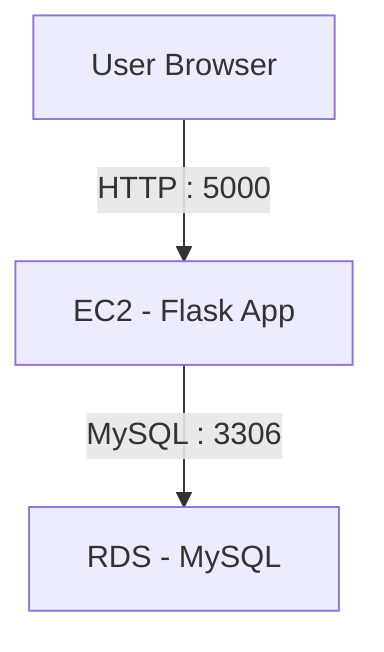

# Flask User Management API (Full Stack)

## Project Overview
A full-stack web application built using Flask that allows users to be created and viewed through a web interface. The backend is deployed on AWS EC2 and connected securely to an AWS RDS MySQL database.

## Tech Stack
- Python (Flask)
- HTML, CSS, JavaScript
- AWS EC2
- AWS RDS (MySQL)
- GitHub

## Features
- Add new users
- View existing users
- Secure database access using Security Groups
- Simple and clean UI with custom CSS theme

## System Architecture
The user accesses the application through a web browser. Requests are sent to a Flask application hosted on an AWS EC2 instance via HTTP on port **5000**.  
The Flask backend securely communicates with an AWS RDS MySQL database over port **3306** using restricted Security Group rules.



## Deployment
- EC2 instance hosts Flask application
- RDS is private and accessible only from EC2
- Application runs on port 5000

## Monitoring
- Basic EC2 monitoring enabled using AWS CloudWatch

## How to Run
```bash
source venv/bin/activate
pip install -r requirements.txt
python app.py


